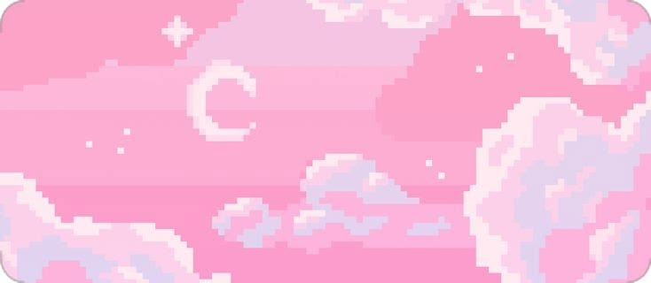

<!-- BANNER -->

 

 

# **𝑮𝒆𝒏𝒌𝒂𝒘𝒂**

### Programação • Automação • Tecnologia

 

 

---

## Sobre mim

Olá! Eu sou a **Genkawa**, tenho **22 anos** e sou **Técnica em Automação Industrial**.

Atualmente estou estudando **programação e desenvolvimento de software**, explorando diferentes áreas da tecnologia e transformando o que aprendo em projetos.

Tenho conhecimento em **C, C++, Arduino e CLP** e atualmente estou estudando **HTML, CSS, JavaScript, CEF e Pawn**.

Meu objetivo é continuar evoluindo, desenvolver projetos próprios e transformar ideias em código.

---

## Projetos

<h3>
  
  Sky Pixel Roleplay
</h3>

  Servidor de Roleplay em desenvolvimento.

 

---
<!-- PIXEL 1 -->

## Contato

---

 

### Aprendendo • Construindo • Evoluindo

 

**𝑮𝒆𝒏𝒌𝒂𝒘𝒂**

  

&nbsp;&nbsp;&nbsp;&nbsp;

<!-- PIXEL 2 -->

  

### 玄川

 

**学び ・ 創造 ・ 成長**

