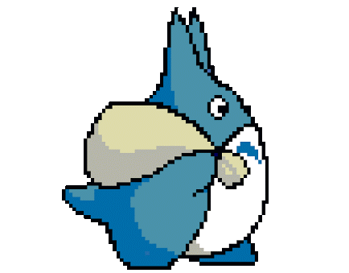
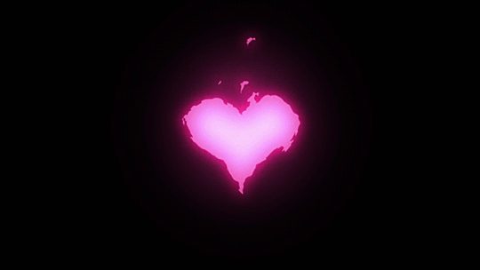

<!-- BANNER -->

 

# **𝑮𝒆𝒏𝒌𝒂𝒘𝒂**

### Programação • Automação • Tecnologia

 

 

---

## Sobre mim

Olá! Eu sou a **Isabella Genkawa**, tenho **22 anos** e sou **Técnica em Automação Industrial**.

Atualmente estou estudando **programação e desenvolvimento de software**, explorando diferentes áreas da tecnologia.

Meu objetivo é continuar evoluindo, desenvolver projetos próprios e transformar ideias em código.

<h2 align="center">
  
  Spotify
</h2>

---

<!-- TOToro -->

---

## Projetos

<h3>
  
  Sky Pixel Roleplay
</h3>

  Servidor de Roleplay em desenvolvimento.

 

---

<!-- BANNER GIF -->

  

<h2>
  
  <i>𝒞𝒶𝓈𝒶𝒹𝒶 𝒸𝑜𝓂 𝒩𝒶𝓉𝒶́𝓁𝒾𝒶</i>
</h2>

## Contato

---

 

### Aprendendo • Construindo • Evoluindo

 

**𝑮𝒆𝒏𝒌𝒂𝒘𝒂**

  

&nbsp;&nbsp;&nbsp;&nbsp;

<!-- PIXEL 2 -->

  

### 玄川

 

**学び ・ 創造 ・ 成長**

